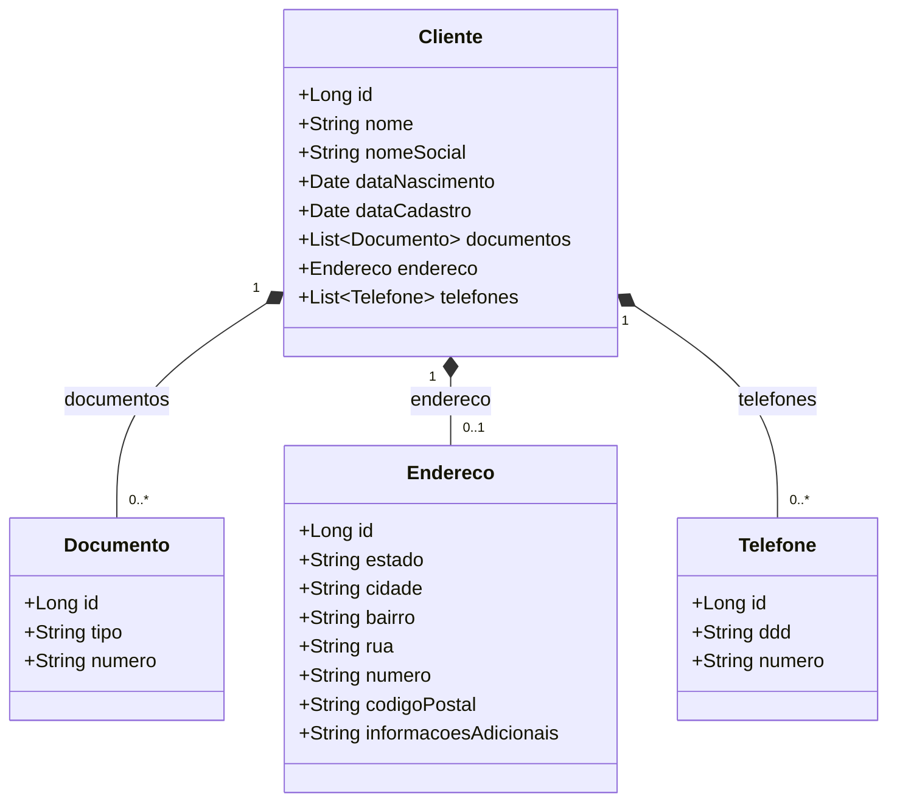

# 🚗 AutoBots — Microsserviço de Gestão de Clientes (`automanager`)

[](https://openjdk.org/)
[](https://spring.io/projects/spring-boot)
[](https://github.com/)
[](LICENSE)

> **Atividade Prática ATVI**  
> **Instituição:** Faculdade de Tecnologia do Estado de São Paulo (FATEC) — São José dos Campos  
> **Curso:** Análise e Desenvolvimento de Sistemas (3º Semestre)  
> **Disciplina:** Desenvolvimento Web III  
> **Docente:** Prof. Dr. Eng. Gerson Penha  

---

## 📖 1. Sobre o Projeto

O **AutoBots** é uma solução em arquitetura de microsserviços voltada à gestão de lojas especializadas em manutenção veicular e comercialização de autopeças. O módulo **`automanager`** é o microsserviço responsável pelo núcleo de cadastro e gerenciamento das informações dos clientes e seus agregados.

### 🎯 Objetivos da Atividade
- Implementar operações completas de **CRUD** (Criar, Ler/Selecionar, Atualizar e Excluir) para todas as 4 entidades da base de dados: **Cliente**, **Documento**, **Endereço** e **Telefone**.
- Aplicar boas práticas de arquitetura em camadas e princípios **SOLID** com classes especializadas de regras de negócio (*Atualizadores* e *Selecionadores*).
- Adequar o padrão RESTful nos controladores, retornando códigos de status HTTP semânticos (`200 OK`, `201 Created`, `400 Bad Request`, `404 Not Found`).
- Corrigir inconsistências herdadas do código base (bugs no seeder, atributos omitidos, comparações de objetos).
- Garantir a integridade referencial com relacionamentos JPA em cascata (`CascadeType.ALL`, `orphanRemoval = true`).

---

## 🏛️ 2. Arquitetura e Estrutura de Pacotes

O projeto adota uma arquitetura em camadas bem definida, separando entidades de banco, repositórios de dados, regras de negócio e controladores REST:

```
com.autobots.automanager/
│
├── entidades/          # Entidades JPA (Mapeamento Objeto-Relacional)
│   ├── Cliente.java    # Entidade raiz/agregadora
│   ├── Documento.java  # RG, CPF, Passaporte, etc.
│   ├── Endereco.java   # Endereço residencial/comercial
│   └── Telefone.java   # Contatos telefônicos com DDD
│
├── repositorios/       # Interfaces Spring Data JPA (Data Access Layer)
│   ├── ClienteRepositorio.java
│   ├── DocumentoRepositorio.java
│   ├── EnderecoRepositorio.java
│   └── TelefoneRepositorio.java
│
├── modelo/             # Regras de Negócio e Padrões de Projeto (Domain Services)
│   ├── ClienteAtualizador.java
│   ├── DocumentoAtualizador.java
│   ├── EnderecoAtualizador.java
│   ├── TelefoneAtualizador.java
│   ├── ClienteSelecionador.java
│   ├── DocumentoSelecionador.java
│   ├── EnderecoSelecionador.java
│   ├── TelefoneSelecionador.java
│   └── StringVerificadorNulo.java
│
└── controles/          # Camada REST (Endpoints da API)
    ├── ClienteControle.java
    ├── DocumentoControle.java
    ├── EnderecoControle.java
    └── TelefoneControle.java
```

### 🧩 Diagrama de Relacionamento das Entidades



---

## 🌐 3. Documentação da API REST

Todos os endpoints respondem em `http://localhost:8080`.  
Para máxima compatibilidade com suítes de testes, ferramentas REST e Postman, os endpoints de consulta suportam tanto `/{id}` quanto `/{entidade}/{id}`, e as exclusões aceitam tanto parâmetro de URL (`/excluir/{id}`) quanto corpo JSON (`/excluir`).

### 👤 Endpoints de Cliente (`/cliente`)
| Método | Endpoint | Descrição | Status Sucesso |
| :--- | :--- | :--- | :---: |
| `POST` | `/cliente/cadastro` | Cadastra um novo cliente (com endereço, docs e telefones) | `201 Created` |
| `GET` | `/cliente/clientes` | Lista todos os clientes cadastrados | `200 OK` |
| `GET` | `/cliente/{id}` | Busca cliente específico pelo ID | `200 OK` / `404` |
| `PUT` | `/cliente/atualizar` | Atualiza dados cadastrais do cliente e dependentes | `200 OK` / `404` |
| `DELETE` | `/cliente/excluir/{id}` | Remove cliente e dispara **exclusão em cascata** | `200 OK` / `404` |
| `DELETE` | `/cliente/excluir` | Remove cliente passando JSON `{"id": X}` no corpo | `200 OK` / `404` |

### 📄 Endpoints de Documento (`/documento`)
| Método | Endpoint | Descrição | Status Sucesso |
| :--- | :--- | :--- | :---: |
| `POST` | `/documento/cadastro` | Cadastra um documento avulso | `201 Created` |
| `GET` | `/documento/documentos` | Lista todos os documentos | `200 OK` |
| `GET` | `/documento/{id}` | Busca documento por ID | `200 OK` / `404` |
| `PUT` | `/documento/atualizar` | Atualiza tipo ou número de um documento | `200 OK` / `404` |
| `DELETE` | `/documento/excluir/{id}` | Remove documento (desvinculando do cliente pai) | `200 OK` / `404` |
| `DELETE` | `/documento/excluir` | Remove documento via corpo JSON | `200 OK` / `404` |

### 📍 Endpoints de Endereço (`/endereco`)
| Método | Endpoint | Descrição | Status Sucesso |
| :--- | :--- | :--- | :---: |
| `POST` | `/endereco/cadastro` | Cadastra um endereço avulso | `201 Created` |
| `GET` | `/endereco/enderecos` | Lista todos os endereços | `200 OK` |
| `GET` | `/endereco/{id}` | Busca endereço por ID | `200 OK` / `404` |
| `PUT` | `/endereco/atualizar` | Atualiza campos de endereço | `200 OK` / `404` |
| `DELETE` | `/endereco/excluir/{id}` | Remove endereço (desvinculando do cliente) | `200 OK` / `404` |
| `DELETE` | `/endereco/excluir` | Remove endereço via corpo JSON | `200 OK` / `404` |

### 📞 Endpoints de Telefone (`/telefone`)
| Método | Endpoint | Descrição | Status Sucesso |
| :--- | :--- | :--- | :---: |
| `POST` | `/telefone/cadastro` | Cadastra um telefone avulso | `201 Created` |
| `GET` | `/telefone/telefones` | Lista todos os telefones | `200 OK` |
| `GET` | `/telefone/{id}` | Busca telefone por ID | `200 OK` / `404` |
| `PUT` | `/telefone/atualizar` | Atualiza DDD ou número de telefone | `200 OK` / `404` |
| `DELETE` | `/telefone/excluir/{id}` | Remove telefone (desvinculando do cliente pai) | `200 OK` / `404` |
| `DELETE` | `/telefone/excluir` | Remove telefone via corpo JSON | `200 OK` / `404` |

---

## 📦 4. Exemplos de Payloads JSON

### Cadastro Completo de Cliente (`POST /cliente/cadastro`)
```json
{
  "nome": "Alberto Santos Dumont",
  "nomeSocial": "Santos Dumont",
  "dataNascimento": "1873-07-20T00:00:00.000+00:00",
  "dataCadastro": "2026-09-26T00:00:00.000+00:00",
  "endereco": {
    "estado": "Minas Gerais",
    "cidade": "Palmira",
    "bairro": "Cabangu",
    "rua": "Estrada Fazenda Cabangu",
    "numero": "S/N",
    "codigoPostal": "36240000",
    "informacoesAdicionais": "Museu de Cabangu"
  },
  "documentos": [
    {
      "tipo": "PASSAPORTE",
      "numero": "BR1906"
    },
    {
      "tipo": "CPF",
      "numero": "11122233344"
    }
  ],
  "telefones": [
    {
      "ddd": "32",
      "numero": "999887766"
    }
  ]
}
```

### Atualização Parcial (`PUT /cliente/atualizar`)
```json
{
  "id": 1,
  "nomeSocial": "Dom Pedro I",
  "endereco": {
    "numero": "1800",
    "informacoesAdicionais": "Palácio Imperial"
  }
}
```

---

## 🛠️ 5. Principais Correções e Melhorias Técnicas

Durante o desenvolvimento das etapas do projeto, foram solucionados diversos problemas presentes no código base inicial:

1. **Correção de Carga Inicial (`Runner`)**:
   - O objeto `cpf` estava instanciado incorretamente com `cpf.setTipo("RG")`. Alterado para `cpf.setTipo("CPF")`.
   - Implementada trava de **idempotência** no seeder inicial para impedir violações de unicidade (`Unique constraint violation` em `Documento.numero`) em reexecuções de contexto de testes.
2. **Atualização Completa de Endereço**:
   - A classe `EnderecoAtualizador` omitia o atributo `codigoPostal`, gerando perda de dados. O atributo foi adicionado e validado.
3. **Comparação Segura de Identificadores (Wrappers `Long`)**:
   - Em `DocumentoAtualizador` e `TelefoneAtualizador`, as comparações usavam `atualizacao.getId() == doc.getId()`. Como o tipo é `Long`, comparações de instâncias fora do pool de cache podiam falhar. Foi alterado para `.equals()`.
4. **Compatibilidade com JDK 21**:
   - Ajustada a propriedade `<lombok.version>1.18.30</lombok.version>` no `pom.xml`, corrigindo o erro `NoSuchFieldError: JCImport qualid` ocasionado por incompatibilidades do compilador javac do Java 21 com o Lombok legado do Spring Boot 2.6.
5. **Console do Banco H2**:
   - Habilitado console web no `application.properties` para inspeção visual do banco de dados em memória.
   - **URL:** `http://localhost:8080/h2-console`  
   - **JDBC URL:** `jdbc:h2:mem:automanagerdb`  
   - **Usuário:** `sa` | **Senha:** *(vazio)*

---

## 🚀 6. Como Executar a Aplicação

### Pré-requisitos
- **Java Development Kit (JDK):** Versão 17 ou 21 instalada.
- **Git**

### Passo a passo
1. Clone o repositório ou acesse a pasta do projeto:
   ```bash
   cd autobots/atvi-autobots-microservico-spring/automanager
   ```
2. Inicie a aplicação com o Maven Wrapper:
   ```bash
   ./mvnw spring-boot:run
   ```
3. A aplicação estará pronta e respondendo em `http://localhost:8080`.

---

## 🧪 7. Testes e Validação

O projeto conta com validação dupla: suíte automatizada em Java e script interativo cURL:

### 1. Testes Automatizados JUnit 5 / Spring MockMvc
Localizados em: [`src/test/java/com/autobots/automanager/Fase6EndpointsTest.java`](file:///home/pedro/Documentos/FATEC/3Semestre/DesenvolvimentoWebIII/atv/atvi/autobots/atvi-autobots-microservico-spring/automanager/src/test/java/com/autobots/automanager/Fase6EndpointsTest.java).  
Para rodar todos os 17 testes automatizados:
```bash
cd autobots/atvi-autobots-microservico-spring/automanager
./mvnw test
```
**Resultado:**
```text
[INFO] Results:
[INFO] Tests run: 17, Failures: 0, Errors: 0, Skipped: 0
[INFO] BUILD SUCCESS
```

### 2. Script de Bateria de Testes cURL
Com a aplicação em execução (`./mvnw spring-boot:run`), execute o script na raiz do projeto:
```bash
chmod +x test_fase6_curl.sh
./test_fase6_curl.sh
```
O script valida todas as operações de cadastro, busca existente e inexistente (404), listagens, atualizações, exclusões diretas e confirmação da **exclusão em cascata**.

---

## 📋 8. Resumo do Roadmap de Desenvolvimento

Conforme detalhado no arquivo [`ROADMAP.md`](file:///home/pedro/Documentos/FATEC/3Semestre/DesenvolvimentoWebIII/atv/atvi/ROADMAP.md):

- [x] **Fase 1:** Correções no Código Base Existente (Carga Inicial, Atualizador e Controller de Cliente)
- [x] **Fase 2:** Criação dos Repositórios Faltantes (`DocumentoRepositorio`, `EnderecoRepositorio`, `TelefoneRepositorio`)
- [x] **Fase 3:** Criação dos Selecionadores na Camada de Negócio (`DocumentoSelecionador`, `EnderecoSelecionador`, `TelefoneSelecionador`)
- [x] **Fase 4:** Implementação dos Novos Controladores REST (`DocumentoControle`, `EnderecoControle`, `TelefoneControle`)
- [x] **Fase 5:** Configuração e Disponibilização do Console H2
- [x] **Fase 6:** Validação Completa de Todos os Endpoints via JUnit e cURL
